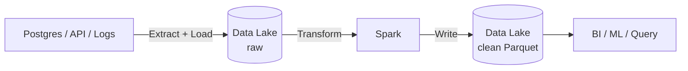
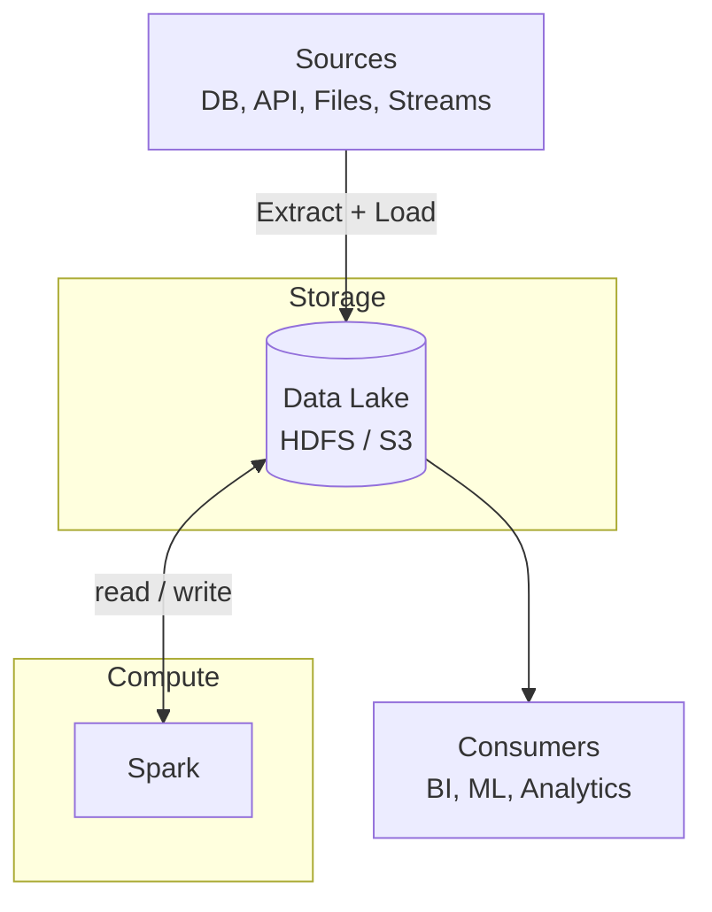

Khi bắt đầu với data engineering, ta thường gặp một loạt thuật ngữ cùng lúc: Data Lake, Hadoop, Spark, ETL. Bài này đặt chúng vào một bức tranh chung: cái nào lo việc **lưu**, cái nào lo việc **tính**, và ETL nằm ở đâu. Các bài sau sẽ đi sâu từng phần.

## Vấn đề ban đầu

Khi dữ liệu vượt quá khả năng của một máy, ta gặp hai bài toán tách biệt:

- **Storage**: lưu dữ liệu ở đâu khi ổ đĩa một máy không đủ?
- **Compute**: tính toán thế nào khi một máy xử lý quá chậm?

Toàn bộ big data stack là lời giải cho hai câu hỏi này. Nhớ cách chia này, vì nó xuất hiện xuyên suốt bài viết.

## Data Lake: nơi lưu dữ liệu

**Data Lake** là kho lưu trữ dữ liệu ở dạng **thô**, với mọi định dạng: bảng từ database, file CSV/JSON, log, ảnh, và cả dữ liệu streaming.

Hai đặc điểm chính:

- **Lưu trước, xử lý sau**: không cần định nghĩa cấu trúc trước khi ghi.
- **Schema-on-read**: cấu trúc chỉ được áp lên dữ liệu khi đọc. Data Warehouse truyền thống thì ngược lại (schema-on-write).

Ban đầu Data Lake được xây trên **HDFS**. Ngày nay phần lớn dùng **object storage** trên cloud như Amazon S3, Google Cloud Storage, Azure Data Lake Storage vì rẻ, bền và gần như không giới hạn dung lượng.

Lưu ý: Data Lake không được quản trị tốt sẽ biến thành _data swamp_, tức là kho dữ liệu không ai biết bên trong có gì, có đáng tin không.

## Hadoop: thế hệ đầu tiên

Hadoop là hệ sinh thái mã nguồn mở đầu tiên giải quyết cả hai bài toán trên cụm nhiều máy thông thường. Ba thành phần cốt lõi:

| Thành phần    | Vai trò                                                                              |
| ------------- | ------------------------------------------------------------------------------------ |
| **HDFS**      | Lưu trữ phân tán. File được chia thành block, mỗi block được nhân bản ra nhiều máy   |
| **MapReduce** | Mô hình tính phân tán: map → shuffle → reduce                                        |
| **YARN**      | Quản lý tài nguyên (CPU, RAM) của cụm và phân phối cho các job                       |

Hadoop chứng minh được rằng có thể xử lý dữ liệu lớn bằng nhiều máy rẻ tiền. Tuy nhiên MapReduce có hai hạn chế lớn:

- **Chậm**: mỗi bước đều ghi kết quả trung gian xuống đĩa.
- **Khó viết**: logic phức tạp phải ghép nhiều job MapReduce lại với nhau.

## Spark: thế hệ tiếp theo

**Apache Spark** ra đời để giải quyết đúng hai hạn chế đó, và là engine **compute** chính hiện nay.

- **Tính trong bộ nhớ**: giữ dữ liệu trung gian trong RAM thay vì ghi xuống đĩa, nên nhanh hơn MapReduce đáng kể, nhất là với thuật toán lặp.
- **API cấp cao**: DataFrame và Spark SQL, viết bằng Python, Scala, SQL.
- **Lazy evaluation và DAG**: Spark ghi nhận chuỗi phép biến đổi thành một đồ thị, tối ưu rồi mới chạy khi có yêu cầu kết quả.
- **Một engine cho nhiều việc**: batch, SQL, streaming, machine learning.

Một điểm cần nhớ: **Spark chỉ là compute**. Nó không có storage riêng, mà đọc và ghi dữ liệu trên HDFS, S3 hoặc nơi khác. Nhờ vậy Spark không bắt buộc phải chạy trên Hadoop.

## ETL: luồng dữ liệu chạy giữa storage và compute

**ETL** là quy trình đưa dữ liệu từ nguồn về dạng dùng được:

- **Extract**: lấy dữ liệu từ nguồn (database, API, file, log).
- **Transform**: làm sạch, chuẩn hóa, join, tổng hợp.
- **Load**: nạp kết quả vào nơi lưu trữ hoặc phân tích.

Trong bối cảnh Data Lake có hai biến thể:

- **ETL**: transform trước, rồi mới load vào đích.
- **ELT**: load dữ liệu thô vào lake trước, transform sau bằng compute engine như Spark. Đây là cách phổ biến hơn với Data Lake, vì lưu dữ liệu thô rất rẻ và ta có thể transform lại bất cứ lúc nào.

Một luồng ELT điển hình:

## Bức tranh tổng thể

Ghép các mảnh lại:

- **Data Lake** là tầng storage.
- **Spark** là tầng compute.
- **ETL** là luồng dữ liệu chạy qua hai tầng đó.
- **Hadoop** là thế hệ đầu, gắn storage (HDFS) và compute (MapReduce) vào cùng một cụm.

Đây cũng là thay đổi lớn nhất giữa hai thế hệ: **tách storage khỏi compute**. Trên cloud, dữ liệu nằm ở S3 còn cụm Spark bật lên khi cần và tắt khi xong. Ta chỉ trả tiền compute khi thật sự tính, và có thể mở rộng hai phần độc lập với nhau.

## Tiếp theo

Các bài sau sẽ đi vào từng phần:

1. HDFS và Hadoop chi tiết
2. Spark: kiến trúc và cách hoạt động
3. Data Lake: tổ chức dữ liệu (Medallion, Parquet, Delta/Iceberg)
4. ETL với Spark: thực hành
5. Orchestration, data quality và vận hành
